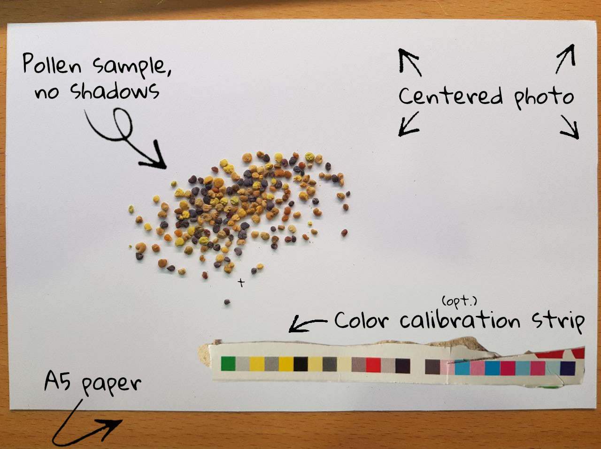

# What is Pollenyzer?

Pollen is known to be the only source of proteins and fats for honey bees. Therefore it is an important part of the honey bees’ nutrition. They are essential for brood care and a good indicator of the quality of a site. It is also known that a diverse diet makes colonies more robust, also in relation to winter losses. Pollenyzer allows to quantify the pollen from a pollen trap and to determine its colours in an automatic way. The colour diversity is closely related to the actual plant diversity. This correlation allows conclusions to be drawn on the quality of a site and on biodiversity in general.



*The image above gives an impression for a possible use case. Note the optional print test strip that can be used to calibrate the image colors to an absolute color space. Such print test strip can be obtained from any standard Kellogs(TM) cereal packaging from the grocery store.*

# Installation

This module is installable and once installed can be imported typing `import pollenyzer`.

Dev installation prevents pip from copying the files to python's site package directory but instead keeps the source file where they are. This means that all changes to the source file are automatically "updating" the installed package.

Tested on Ubuntu with python 3.7+.

1) Go to directory where `setup.py` is placed.
2) Type `pip install -e .`
3) Install all dependencies `pip install -r requirements.txt`
3) Verify that pip is simply referencing the source files of this project by typing `pip list | grep pollenyzer`.


# Usage

Have a look at the `demo/` directory. You can use the code there as a starting point. In `demo/resources` you can find example image data to work with.

```python
import cv2
from os.path import join
from pollenyzer import Pollenyzer

# load test image
img = cv2.imread(join("resources", "test_img.jpg"))

# perform chromatic assessment
res = Pollenyzer(img)
```

# Result

Results are stored in a dict

```python
res = {
    "pollen_detections": {int: {'y': int, 'x': int, 'r': int, 'g': int, 'b': int}},
    "color_checker": {
        "detected_colors": int[] | None,
        "calibrated_colors": int[] | None,
    },
    "img_height": int,
    "img_width": int,
}
```

Errors are raised when
- no white background was detected ("E01")
- no pollen were detected ("E02")
- calibration failed ("E03")

See `errors.py` for details.


# Citing
This repository accompanies the paper [Introducing Pollenyzer: An app for automatic determination of colour diversity for corbicular pollen loads](https://doi.org/10.1016/j.atech.2023.100263).